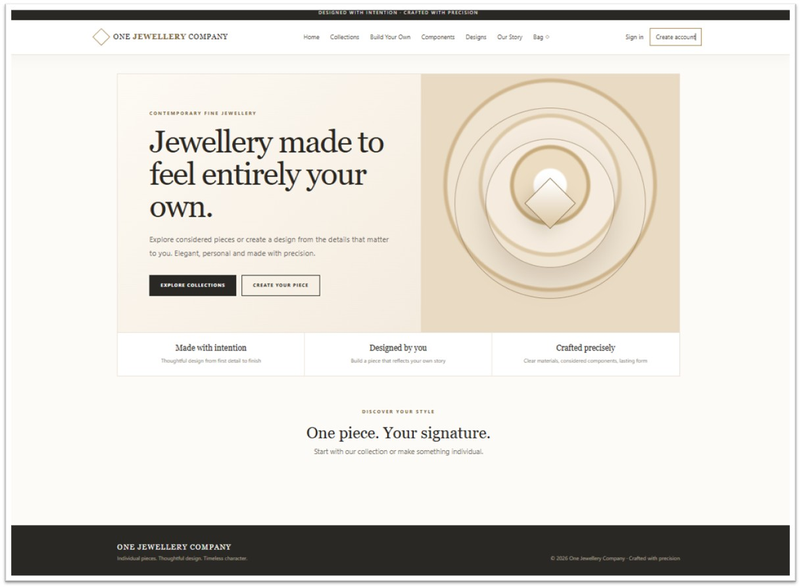
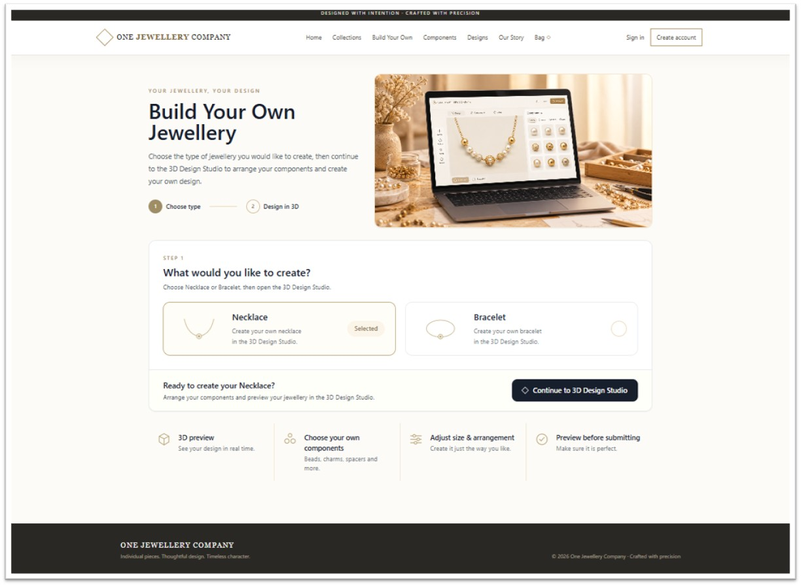
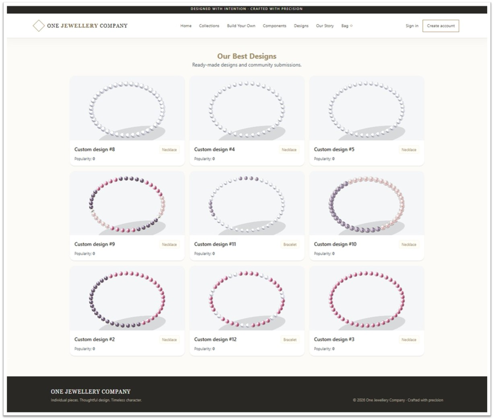
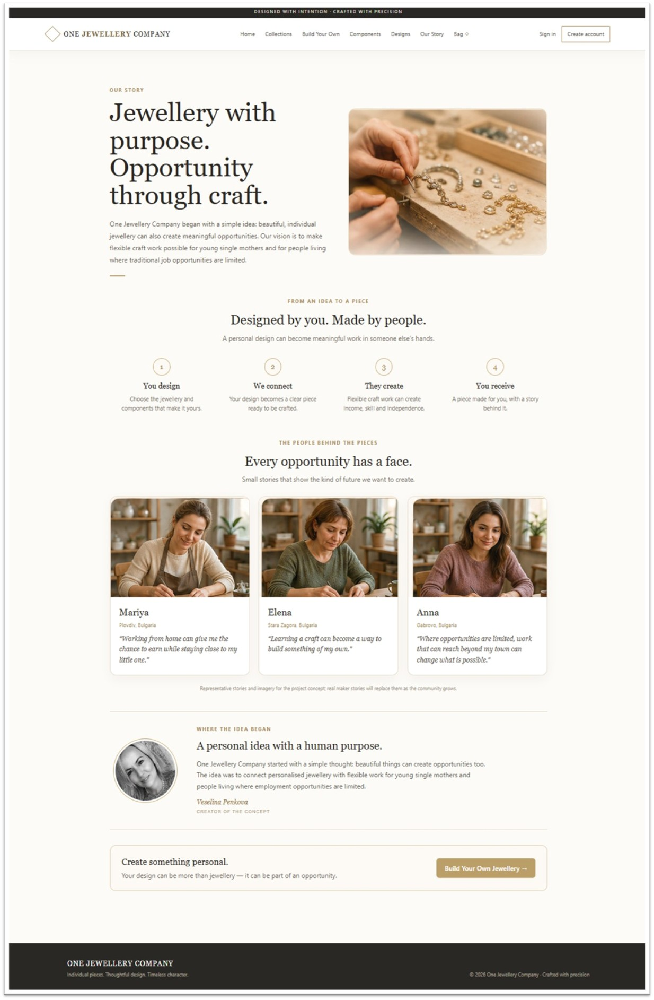
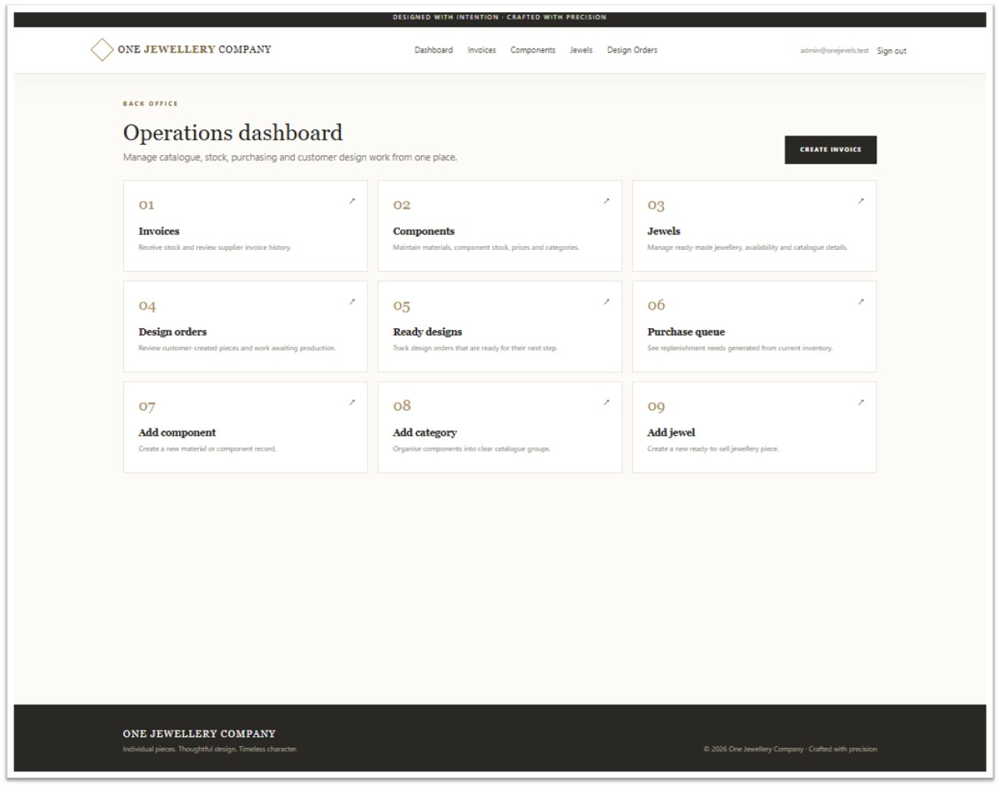

# ◇ One Jewellery Company

**Custom jewellery design, component shopping, ordering, inventory, production, and administration platform built with ASP.NET Core MVC.**

One Jewellery Company is a portfolio web application for creating, ordering, and managing personalized jewellery. Customers can browse ready-made jewellery, purchase individual jewellery components, or create their own bracelet or necklace through an interactive 3D Design Studio.

Administrators can manage components, stock, jewellery, customer design orders, purchasing requirements, production workflows, and internal invoices.

The project also explores a broader idea: connecting personalized jewellery with flexible crafting opportunities for people who may have limited access to traditional employment.

---

## ✨ Implemented Features

### 👤 Customer Experience

- **Build Your Own Jewellery**
  - Choose between necklace and bracelet creation.
  - Continue directly into the interactive 3D Design Studio.
  - Clear two-step customer flow: choose jewellery type → design in 3D.
  - Dedicated visual introduction to the jewellery design process.

- **3D Design Studio**
  - Select jewellery components from the available component palette.
  - Build reusable component sequences and patterns.
  - Configure jewellery length and average bead size.
  - Switch between line and circular previews.
  - Auto-fill designs according to calculated capacity.
  - Adjust rendered size, tilt, and rotation.
  - Preview the finished arrangement before submission.
  - Submit the completed design to the administration and production workflow.

- **Components Shop**
  - Dedicated catalogue for purchasing individual jewellery components.
  - Browse chains, cords, clasps, pendants, beads, pearls, natural stones, magnets, and other available parts.
  - View component images, specifications, prices, and current stock.
  - Select individual quantities.
  - Review selected components and calculated order total.
  - Add loose components directly to the shopping cart independently from the custom jewellery workflow.

- **Collections & Jewellery Catalogue**
  - Browse ready-made jewellery and existing finished designs.
  - View product and collection details.
  - Add ready-made jewellery to the shopping cart.

- **Cart & Checkout**
  - Session-based shopping cart.
  - Supports ready-made jewellery, individual components, and custom products.
  - Quantity management and item removal.
  - Order creation.
  - Inventory validation and deduction.
  - Development/demo payment workflow.

- **Customer Accounts**
  - ASP.NET Core Identity registration and sign-in.
  - Branded authentication interface.

- **Our Story**
  - Presents the concept and social purpose behind One Jewellery Company.
  - Explains the customer-to-maker workflow.
  - Introduces the idea of flexible crafting opportunities.
  - Includes the origin and vision of the project.

---

### 🛠 Administration

- **Dashboard**
  - Central navigation for administrative and production workflows.

- **Components & Categories**
  - Create and edit component categories.
  - Manage component names, pricing, stock, SKU, images, colors, sizes, dimensions, and descriptions.
  - Track available component quantities.

- **Inventory**
  - Stock validation and deduction.
  - Component inventory management.
  - Purchase-need / purchasing-queue support.
  - Inventory updates from internal invoice workflows.

- **Jewellery Catalogue**
  - Create and manage ready-made jewellery.
  - Manage finished-product stock and product information.

- **Design Orders**
  - Review customer-submitted jewellery designs.
  - Preserve exact Design Studio previews.
  - Review component sequences and quantities.
  - Track design and production status.
  - Review designs ready for production.

- **Build Protocol**
  - Provides the maker with the exact jewellery design and required components.
  - Uses the saved Design Studio preview as the production reference.
  - Records component requirements for the finished piece.
  - Supports the manufacturing transition from component inventory to finished jewellery.

- **Invoices**
  - Internal invoice management.
  - Component and unit-cost calculations.
  - Supports inventory-related administrative workflows.

---

## 🧪 Testing

The solution contains two dedicated automated test projects:

- **OneJevelsCompany.UnitTests**
  - NUnit service and business-logic tests.
  - Tests product, order, inventory, payment, and related domain behavior.
  - Uses EF Core InMemory test data where appropriate.

- **OneJevelsCompany.PlaywrightTests**
  - Playwright + NUnit browser/end-to-end testing.
  - Automatically starts the ASP.NET Core web application for browser tests.
  - Covers important customer navigation and catalogue workflows.
  - Existing Qase reporter integration is retained.

---

## 🧰 Technology

- **Framework:** .NET 8 / ASP.NET Core MVC
- **Architecture:** Layered Core / Infrastructure / Web architecture
- **UI:** Razor Views, HTML5, CSS3, Tailwind CSS, and project-specific styling
- **Database:** SQL Server
- **ORM:** Entity Framework Core
- **Authentication:** ASP.NET Core Identity
- **Testing:** NUnit, EF Core InMemory, Microsoft Playwright
- **Development:** Visual Studio
- **Version Control:** Git / GitHub

---

## 👥 Roles

**Customer**

Browse ready-made jewellery, shop individual components, create personalized necklace or bracelet designs in the 3D Design Studio, manage a shopping cart, submit orders, and use account functionality.

**Admin**

Manage components, categories, inventory, jewellery, customer design orders, purchasing requirements, production workflows, Build Protocols, and invoices.

---

## 🏗️ Solution Architecture

The application has been refactored into separate projects with clearer responsibility boundaries:

```text
One Jewellery Company
│
├── OneJevelsCompany.Core
│   ├── Entities
│   ├── Enums
│   ├── Interfaces
│   ├── Services
│   ├── Exceptions
│   └── ValueObjects
│
├── OneJevelsCompany.Infrastructure
│   ├── Inventory
│   ├── Orders
│   ├── Payments
│   ├── Products
│   └── Persistence
│       └── Migrations
│
├── OneJevelsCompany.Web
│   ├── Areas
│   ├── Controllers
│   ├── Models
│   ├── Services
│   ├── Views
│   └── wwwroot
│
├── OneJevelsCompany.UnitTests
│
└── OneJevelsCompany.PlaywrightTests
```

### Architecture Responsibilities

**Core**

Contains the application's domain entities, enums, service contracts, value objects, and business abstractions. It does not depend on the Web or Infrastructure projects.

**Infrastructure**

Contains persistence and service implementations, including Entity Framework Core database access, inventory, orders, products, payments, database migrations, and data seeding.

**Web**

Contains the ASP.NET Core MVC presentation layer: controllers, Razor views, UI-specific models, session-based cart functionality, Identity UI, and static assets.

**Tests**

Unit and browser automation projects are separated from the production application and reference the appropriate application layers.

---

## 🔄 Main Customer Workflows

### Ready-Made Jewellery

```text
Collections
    ↓
Choose finished jewellery
    ↓
Add to Cart
    ↓
Checkout
```

### Custom Jewellery

```text
Build Your Own
    ↓
Choose Necklace or Bracelet
    ↓
3D Design Studio
    ↓
Choose and arrange components
    ↓
Preview design
    ↓
Submit Design Order
    ↓
Administration / Production
```

### Individual Components

```text
Components
    ↓
Choose loose jewellery parts
    ↓
Select quantities
    ↓
Review order
    ↓
Cart
    ↓
Checkout
```

These workflows are intentionally separated so purchasing loose components does not create a custom jewellery design, and browsing ready-made collections remains independent from the Design Studio.

---

## 🏭 Design-to-Production Workflow

Customer-created jewellery moves from design into production while preserving the original design information:

```text
Customer Design
      ↓
Design Order
      ↓
Admin Review
      ↓
Component Availability
      ↓
Build Protocol
      ↓
Production
      ↓
Finished Jewellery
```

The **Build Protocol** acts as both the maker's manufacturing instruction and the link between component inventory and the resulting finished jewellery piece.

---

## 🚀 Planned Enhancements

- More advanced 3D jewellery visualization and component positioning.
- Additional clasp and stringing-material visualization.
- Further necklace-specific and bracelet-specific Design Studio behavior.
- Expanded production and maker workflow.
- Printable/PDF production documentation.
- Expanded automated invoice generation and pricing rules.
- Company/customer organization records and richer order history.
- Extended reporting and real-time administrative statistics.
- Production-ready payment provider integration.
- Additional unit and Playwright end-to-end coverage.
- Replacement of representative maker stories with real participant stories as the project develops.

---

## 📸 Portfolio Screenshots

### Home



### Build Your Own Jewellery



### 3D Design Studio


### Components Shop



### Our Story



### Admin Dashboard



---

## ℹ️ Development Notes

- Payment currently uses a **development/demo flow** and is not a production payment integration.
- Representative maker portraits and stories on **Our Story** are concept content, not real participant testimonials.
- Development administrator seeding is intended for local development only.
- Stock, pricing, ordering, and inventory behavior should be validated with the included automated tests whenever business rules change.
- The `main` branch contains the current refactored application architecture.

---

**Developed with ASP.NET Core MVC, Entity Framework Core & SQL Server**

© 2026 One Jewellery Company
